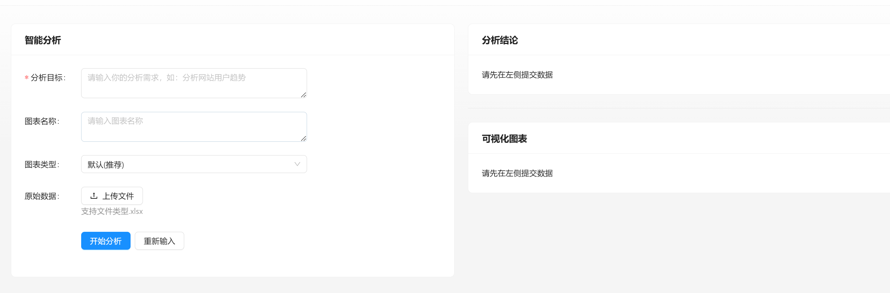
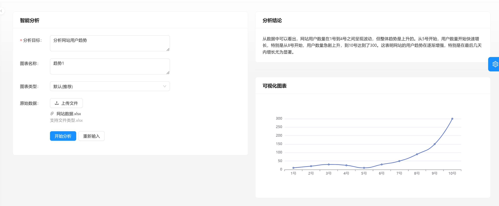
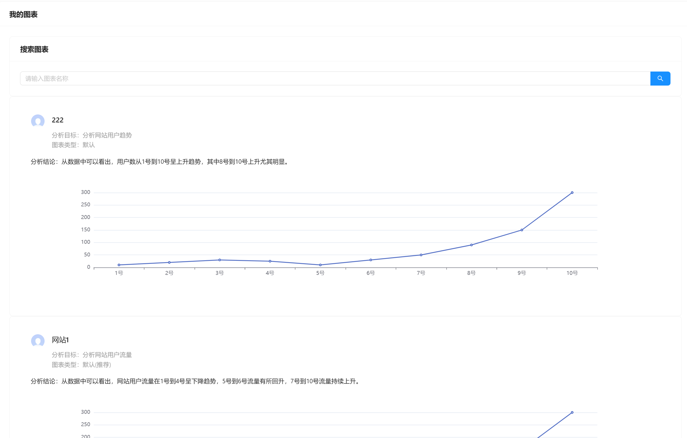

# NX 智能 BI 系统

## 项目介绍

基于 Spring Boot + AIGC 的智能数据分析平台。区别于传统BI，用户只需要导入Excel原始数据集，并输入分析诉求，就能自动化生成可视化图表及分析结论，提高数据分析效率

### 技术栈

#### 前端

1. React
2. Umi + Ant Design Pro
3. 可视化开发库（Echarts + HighCharts + AntV）
   使用Echarts因为其兼容性较好
4. umi openapi 代码生成（自动生成后端调用代码）

#### 后端

1. Spring Boot
2. MySQL数据库
3. MyBatis Plus数据访问框架
4. AI能力（Open AI接口开发/现成AI接口）
5. Excel上传和数据的解析（Easy Excel）
6. Swagger + Knife4j项目接口文档
7. Hutool 工具库
8. Guava 工具库（Guava 本地缓存、限流器和 sse 消息推送）
9. SseEmitter 服务推送事件

## 功能展示

## 图表分析

## 图表管理

